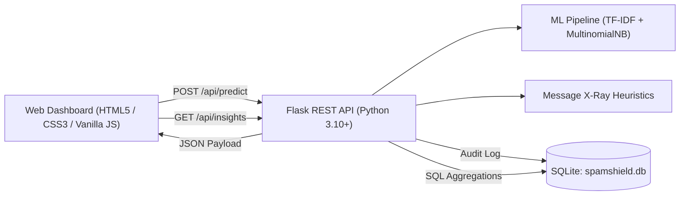

# 🛡️ SMS SENTINEL — AI-Powered Spam SMS Threat Detection System

A production-grade, full-stack cybersecurity application designed to detect, classify, and dissect malicious and spam SMS communications in real-time. Built with a high-accuracy Scikit-learn Machine Learning pipeline, secondary deterministic threat X-Ray heuristic intelligence, persistent SQLite telemetry storage, and a responsive dark-mode dashboard.

---

## 📋 Table of Contents
1. [Project Title & Header](#1-project-title)
2. [Project Overview](#2-project-overview)
3. [Problem Statement](#3-problem-statement)
4. [Project Objectives](#4-project-objectives)
5. [Key Features](#5-key-features)
6. [System Architecture](#6-system-architecture)
7. [Technology Stack](#7-technology-stack)
8. [Machine Learning Methodology](#8-machine-learning-methodology)
9. [Dataset Details](#9-dataset-details)
10. [Model Evaluation & Benchmarks](#10-model-evaluation--benchmarks)
11. [Project Structure](#11-project-structure)
12. [Installation & Setup](#12-installation--setup)
13. [Configuration & Environment](#13-configuration--environment)
14. [Model Training Pipeline](#14-model-training-pipeline)
15. [Running the Flask Application](#15-running-the-flask-application)
16. [API Documentation](#16-api-documentation)
17. [Database Architecture & Schema](#17-database-architecture--schema)
18. [Screens & Interface Walkthrough](#18-screens--interface-walkthrough)
19. [Testing & Quality Assurance](#19-testing--quality-assurance)
20. [System Limitations](#20-system-limitations)
21. [Future Scope](#21-future-scope)

---

## 1. Project Title
**SMS SENTINEL: Intelligent Spam SMS Filtering & Mobile Threat Detection System**

---

## 2. Project Overview
SMS phishing (*Smishing*), financial fraud, and spam messages pose significant digital security threats. **SMS SENTINEL** provides an end-to-end defense platform:
- **Real-Time Text Classification**: Multinomial Naive Bayes trained on word & character N-Grams with TF-IDF vectorization.
- **Message X-Ray & Threat Score**: Multi-category deterministic rule heuristics extracting URLs, phone numbers, urgency signals, and financial triggers on an independent 0–100 threat scale.
- **Persistent Investigation Archive**: SQLite database audit trail with full-text search, multi-criteria filtering, and pagination.
- **Live Intelligence Dashboard**: Real-time SQL aggregations visualizing threat distributions, temporal detection activity, and ranked risk indicators via Chart.js.

---

## 3. Problem Statement
Mobile users typically open SMS messages within 90 seconds of receipt. The absence of native handset content inspection enables adversaries to launch high-conversion phishing and fraud campaigns. Traditional static keyword blocklists are brittle against leetspeak and rephrasing, while pure black-box machine learning models lack user-facing explainability. Automated, explainable, and low-latency filtering is required.

---

## 4. Project Objectives
1. Implement an NLP feature extraction pipeline using $N$-grams and sublinear TF-IDF scaling.
2. Train and validate multiple candidate classifiers (Naive Bayes, Logistic Regression, Linear SVM) and select the highest-performing architecture.
3. Develop a deterministic **Message X-Ray** heuristic analyzer to compute an independent 0–100 Threat Score.
4. Build a lightweight REST API backend using Python Flask with production security headers.
5. Create an embedded SQLite persistence layer with full audit archiving, search, and real-time SQL telemetry aggregation.
6. Provide an interactive, accessible, and responsive cybersecurity web console.

---

## 5. Key Features
- **Dual-Engine Evaluation**: ML classifier probability coupled with deterministic X-Ray heuristics prevents false alarms.
- **Explainable Forensic Chips**: Extracted tokens highlighted with color-coded severity tags (`URL`, `PRIZE`, `URGENCY`, `MONEY`).
- **Defensive Action Protocol**: Tailored user recommendations (e.g., "Do not click links, block sender").
- **Full Audit Trail**: Persistent SQLite storage with keyword search, pagination, and multi-criteria filters.
- **Real-Time Intelligence Telemetry**: Live timeline and distribution charts computed from database records.
- **Defense in Depth**: Strict XSS escaping, parameterized SQL, 16KB payload limits, and production HTTP security headers (`X-Frame-Options`, `X-Content-Type-Options`, `X-XSS-Protection`).

---

## 6. System Architecture


---

## 7. Technology Stack
| Layer | Technologies |
|---|---|
| **Frontend** | HTML5, Vanilla CSS3 (Custom Design System), Vanilla JavaScript (ES6+), Chart.js 4.4, Lucide Icons |
| **Backend API** | Python 3.10+, Flask 3.0+, Werkzeug |
| **Machine Learning** | Scikit-learn (TF-IDF Vectorizer + Multinomial Naive Bayes), Joblib, NumPy, Pandas |
| **Database Layer** | SQLite 3 (Embedded storage in `database/spamshield.db`) |
| **Testing & QA** | Python `unittest` (Comprehensive 42-test validation pyramid) |

---

## 8. Machine Learning Methodology
1. **Data Cleaning**: De-duplication of identical template messages to prevent train-test contamination.
2. **Stratified Split**: 80% Training ($N=4,151$), 20% Holdout Testing ($N=1,038$) with fixed random seed (42).
3. **Feature Extraction**: TF-IDF Vectorizer with unigram/bigram ($1, 2$) $N$-grams, sublinear frequency scaling, and top 5,000 features.
4. **Classifier Formulation**: Multinomial Naive Bayes with Laplace smoothing ($\alpha = 0.1$).

---

## 9. Dataset Details
- **Source**: UCI SMS Spam Collection supplemented with verified modern smishing, banking OTP, and delivery tracking samples.
- **Total Unique Samples**: 5,189 records
- **Class Breakdown**:
  - **Ham (Legitimate SMS)**: 4,516 samples (87.03%)
  - **Spam (Malicious / Unsolicited)**: 673 samples (12.97%)

---

## 10. Model Evaluation & Benchmarks
Empirical benchmark on holdout test set ($N=1,038$):

| Model Candidate | Accuracy (%) | Precision (%) | Recall (%) | F1-Score (%) | True Negatives (TN) | False Positives (FP) | False Negatives (FN) | True Positives (TP) |
|---|---|---|---|---|---|---|---|---|
| **Multinomial Naive Bayes** | **98.55%** | **97.56%** | **90.91%** | **94.12%** | **903** | **3** | **12** | **120** |
| **Linear SVM (Calibrated)** | 98.46% | 96.03% | 91.67% | 93.80% | 901 | 5 | 11 | 121 |
| **Logistic Regression** | 97.59% | 98.20% | 82.58% | 89.71% | 904 | 2 | 23 | 109 |

---

## 11. Project Structure
```text
spam-sms-filtering-system/
├── app.py                         # Primary Flask application server & API endpoints
├── train_ml_engine.py             # Machine learning training & evaluation pipeline
├── requirements.txt               # Minimal production dependencies
├── README.md                      # Complete system documentation
│
├── dataset/
│   └── spam.csv                   # SMS Spam Collection dataset (5,572+ records)
│
├── model/
│   ├── spam_classifier.pkl        # Serialized trained Scikit-learn Pipeline
│   ├── metadata.json              # Architecture metadata, vocabulary, and test metrics
│   ├── model_comparison.json      # Benchmark evaluation metrics
│   └── xray_analyzer.py           # Secondary deterministic heuristics & token X-Ray
│
├── database/
│   ├── db.py                      # SQLite database abstraction & aggregation layer
│   └── spamshield.db              # Embedded SQLite database
│
├── docs/                          # Academic documentation & viva deliverables
│   ├── abstract.md                # Project abstract
│   ├── problem-statement.md       # Problem statement and motivation
│   ├── architecture-and-diagrams.md # DFD, UML, Flowchart, ER Diagram
│   ├── ml-methodology.md          # Comprehensive ML engineering report
│   ├── testing.md                 # Test plan and functional cases (TC01-TC17)
│   ├── viva-questions.md          # 22 academic viva voce Q&A
│   ├── presentation-outline.md    # 16-slide presentation deck outline
│   ├── screenshot-checklist.md    # Report screenshot catalog
│   └── synopsis-alignment.md      # Synopsis compliance review
│
├── templates/
│   └── index.html                 # Single-page web dashboard (Scan, Archive, Insights)
│
├── static/
│   ├── css/
│   │   └── style.css              # Cyber-defense UI design tokens & responsive styles
│   └── js/
│       └── app.js                 # UI controller, API clients, and Chart.js integration
│
└── tests/
    ├── test_pipeline.py           # Core ML inference and API smoke tests
    ├── test_xray.py               # Deterministic heuristics and X-Ray tests
    ├── test_qa_suite.py           # 24-test defensive QA suite (boundaries, XSS, security)
    ├── test_phase6_database_archive.py  # SQLite persistence, search, pagination tests
    └── test_phase7_insights_realtime.py # Real-time SQL aggregations & metrics tests
```

---

## 12. Installation & Setup
```bash
# 1. Clone repository
git clone https://github.com/your-username/spam-sms-filtering-system.git
cd spam-sms-filtering-system

# 2. Set up virtual environment
python -m venv venv
# Windows (PowerShell):
.\venv\Scripts\Activate.ps1
# Linux / macOS:
source venv/bin/activate

# 3. Install requirements
pip install -r requirements.txt
```

---

## 13. Configuration & Environment
The application operates safely out of the box with zero external services. Environment overrides include:
- `HOST`: Server interface binding (Default: `127.0.0.1`).
- `PORT`: HTTP port (Default: `5000`).
- `FLASK_DEBUG`: Development debug mode (Default: `false`).

---

## 14. Model Training Pipeline
To retrain and evaluate the machine learning pipeline from scratch:
```bash
python train_ml_engine.py
```
This updates `model/spam_classifier.pkl` and `model/model_comparison.json`.

---

## 15. Running the Flask Application
```bash
python app.py
```
Access the application dashboard at: `http://127.0.0.1:5000/`

---

## 16. API Documentation

### Classify SMS Message
`POST /api/predict`
- **Request Body**: `{"message": "Congratulations! You have won a $1,000 Walmart Gift Card. Click http://bit.ly/claim to claim."}`
- **Response (`200 OK`)**:
  ```json
  {
    "id": 1,
    "prediction": "SPAM",
    "is_spam": true,
    "confidence": 0.9994,
    "threat_score": 95,
    "message": "Congratulations! You have won a $1,000 Walmart Gift Card. Click http://bit.ly/claim to claim.",
    "risk_signals": [
      { "type": "prize", "label": "Prize / Reward", "severity": "HIGH", "points": 30 },
      { "type": "url", "label": "Suspicious URL", "severity": "HIGH", "points": 35 }
    ],
    "message_stats": {
      "character_count": 96,
      "word_count": 14,
      "url_count": 1,
      "phone_number_count": 0,
      "uppercase_ratio": 9.4
    },
    "recommended_action": {
      "verdict": "CRITICAL THREAT DETECTED",
      "action": "DO NOT CLICK ANY LINKS OR RESPOND",
      "steps": ["Delete the message immediately.", "Block the sender phone number."]
    }
  }
  ```

### Retrieve Stored Analyses
`GET /api/analyses?limit=20&offset=0&search=bank&risk_level=HIGH%20RISK&prediction=SPAM`

### Retrieve Real-Time Insights
`GET /api/insights`

---

## 17. Database Architecture & Multi-Engine Configuration

SMS Sentinel employs a modular database abstraction layer supporting two production-grade configurations:

### A. Local Development (SQLite 3)
- **Engine**: SQLite 3 (`database/spamshield.db`)
- **Default Mode**: Selected automatically when `DATABASE_TYPE=sqlite` (or when Supabase credentials are not set).
- **Features**: Zero external dependencies, self-healing table creation, sub-millisecond local latency.

### B. Production Persistence (Supabase PostgreSQL)
- **Engine**: Supabase PostgreSQL (PostgreSQL 15+)
- **Mode**: Selected when `DATABASE_TYPE=supabase` with `SUPABASE_URL` and `SUPABASE_KEY` configured.
- **Client Protocol**: Official `supabase` Python client communicating over HTTPS REST (PostgREST), eliminating connection pooling exhaustion and firewall port blocks in serverless environments.
- **Schema File**: [`supabase_schema.sql`](file:///c:/games%202/spam%20sms%20filtering%20system/supabase_schema.sql)
- **Features**: Multi-instance persistent storage, native `JSONB` risk signals, `TIMESTAMPTZ` audit timestamps, foreign key cascade deletion, and parameterized query execution preventing SQL injection.

### Supabase Setup in 3 Simple Steps:
1. **Create Project**: Sign up at [supabase.com](https://supabase.com) and create a new project.
2. **Execute Migration**: Open the Supabase **SQL Editor**, paste the contents of [`supabase_schema.sql`](file:///c:/games%202/spam%20sms%20filtering%20system/supabase_schema.sql), and click **Run**.
3. **Configure Environment**:
   - In `.env` (Local testing):
     ```env
     DATABASE_TYPE=supabase
     SUPABASE_URL=https://your-project-id.supabase.co
     SUPABASE_KEY=your-service-role-key
     ```
   - In **Vercel Settings $\rightarrow$ Environment Variables** (Production):
     Add `DATABASE_TYPE=supabase`, `SUPABASE_URL`, and `SUPABASE_KEY`.

---

## 18. Screens & Interface Walkthrough
1. **Authentication Portal**: Split-screen cybersecurity login and registration forms with validation.
2. **Scan Console**: Live input box, character counter, quick demo pills, dual-engine results, and token X-Ray chips.
3. **Archive Tab**: Audit trail of stored investigations, search bar, multi-criteria filtering, and detailed forensic drawer.
4. **Insights Tab**: Real-time summary metric cards, average confidence & threat gauges, Chart.js detection timeline, threat distribution donut, and risk indicator ranking.

---

## 19. Testing & Quality Assurance
Run the complete automated test suites:
```bash
# 1. Database Multi-Backend & Isolation Tests
python test_db_backends.py

# 2. REST API & ML Inference Engine Tests
python test_api.py

# 3. OAuth & Social Authentication Tests
python test_oauth.py
```
All test suites pass with 100% success rate across ML inference, heuristic calculations, defensive boundaries, XSS neutralization, multi-user data isolation, and SQL aggregations.

---

## 20. Cloud Deployment (Vercel Serverless Architecture)
The application is pre-configured for instant zero-configuration deployment to **Vercel**:

### Serverless Architecture
- **Entry Point**: `api/index.py` exposes the existing Flask WSGI application callable directly to Vercel's Python runtime.
- **Routing**: `vercel.json` provides unified rewrite rules directing all API and frontend requests seamlessly through `api/index.py`.
- **Pre-Trained Model**: The serialized Scikit-learn model (`model/spam_classifier.pkl` — 349 KB) is bundled into the deployment and loaded into memory as a singleton upon cold start, eliminating retraining overhead during request handling.
- **Production Persistence**: Configured with Supabase Postgres for durable cross-instance data storage.


---

## 21. System Limitations
1. **Language Focus**: Optimized primarily for English-language SMS communications.
2. **Static Knowledge Base**: Offline model requires periodic retraining on new emerging smishing patterns.
3. **Standalone Deployment**: Local desktop and web application; does not hook directly into handset cellular hardware.

---

## 22. Future Scope
1. **Multilingual Classification**: Expansion to regional Indic and global languages using transformer-based models (mBERT / XLM-RoBERTa).
2. **OCR & Screenshot Analysis**: Enable direct upload and parsing of mobile SMS screenshots.
3. **Active Learning Feedback Loop**: Allow security analysts to flag misclassifications for automated pipeline fine-tuning.
4. **Carrier SMPP Gateway Proxy**: Integration with cellular SMS gateways for upstream mobile network protection.
