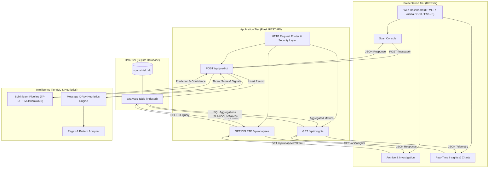
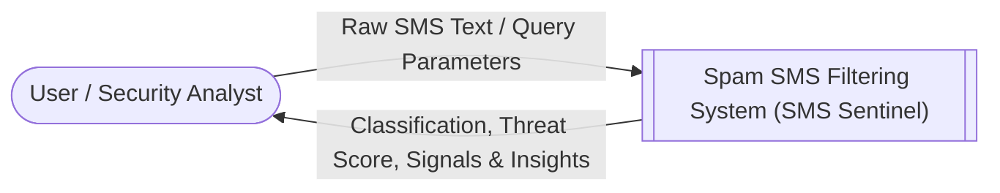
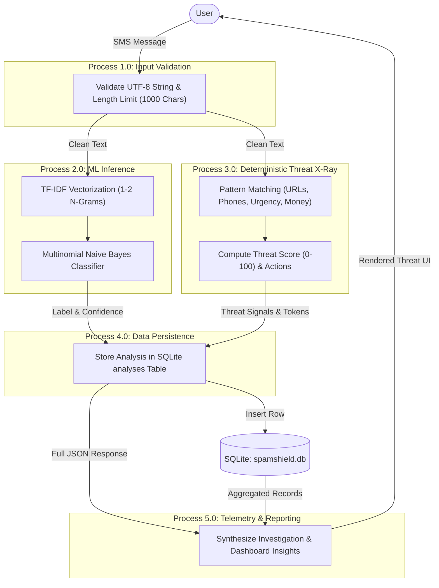
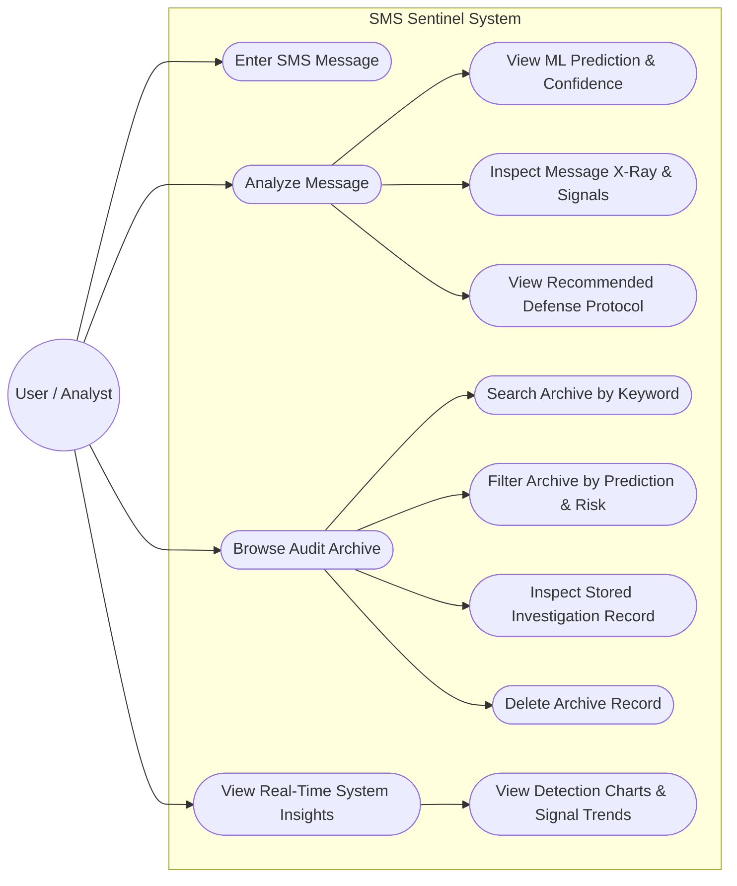
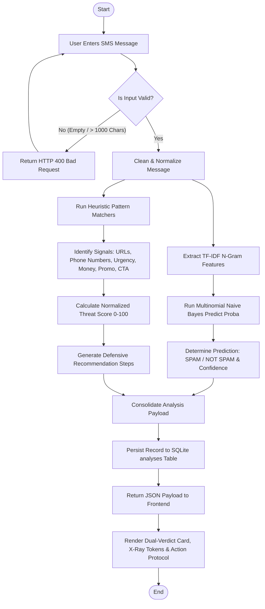
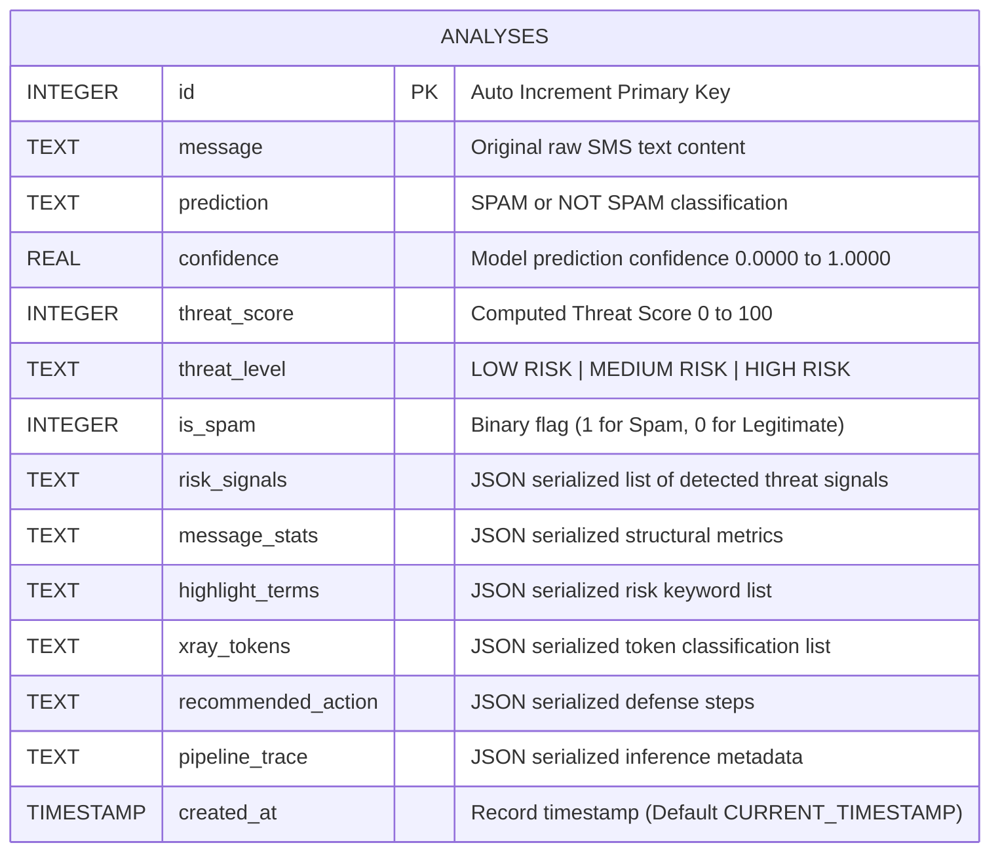

# System Architecture & Technical Diagrams

This document outlines the architectural blueprints, data flow diagrams, use-case models, procedural flowcharts, and entity-relationship models for the **Spam SMS Filtering System (SMS SENTINEL)**.

---

## 1. High-Level System Architecture

---

## 2. Data Flow Diagram — DFD Level 0 (Context Level)

---

## 3. Data Flow Diagram — DFD Level 1 (Detailed Subsystems)

---

## 4. UML Use Case Diagram

---

## 5. End-to-End Process Flowchart

---

## 6. Entity-Relationship (ER) Diagram

The system utilizes a clean, single-table normalized SQLite schema optimized for audit logging and low-latency aggregation:

### Table Index Definitions:
- `idx_analyses_created_at` ON `analyses(created_at DESC)` (Optimizes timeline sorting & activity graphs)
- `idx_analyses_prediction` ON `analyses(prediction)` (Optimizes classification filter queries)
- `idx_analyses_threat_level` ON `analyses(threat_level)` (Optimizes risk severity filter queries)
- `idx_analyses_threat_score` ON `analyses(threat_score)` (Optimizes distribution bucket queries)
